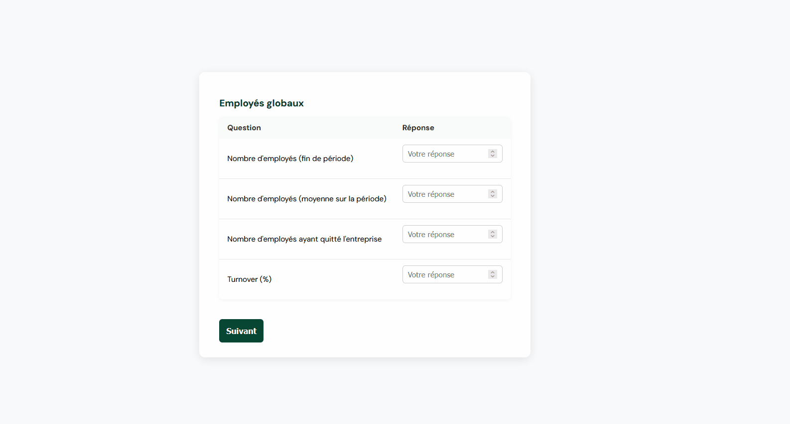

## Form


This project renders a single-page dynamic form based on a hierarchical question catalog. Questions can be nested and tables are supported as question containers.



## Tech Stack

* **Frontend:** React, TypeScript, Vite, React Testing Library
* **Backend:** Java, Spring Boot, JPA/Hibernate
* **Database:** H2
* **Containerization:** Docker, Docker Compose

---

## Getting Started

### Prerequisites
**Option 1: Docker**
* Docker
* Docker Compose

**Option 2: Local Development**
* Node.js >= 20.x
* Java JDK 17+ required for the backend.  
  Recommended: download the installer from [Adoptium](https://adoptium.net/fr/temurin/releases?version=17&os=any&arch=any) and follow the instructions for your OS. After installation, verify with:
  ```bash
  java -version
  javac -version

### Installation & Running

#### With Docker
```bash
# Clone repo
git clone https://github.com/SoniaHM/form.git
cd form

# Launch the application
docker-compose up --build
```

Open `http://localhost:5173`

**To stop:**
```bash
docker-compose down
```

#### Without Docker (Local Development)
```bash
# Clone repo
git clone https://github.com/SoniaHM/form.git
cd form

# Install frontend dependencies
cd frontend
npm install
cd ..
```

**Run Backend:**
```bash
./mvnw spring-boot:run
```

**Run Frontend (in another terminal):**
```bash
cd frontend
npm run dev
```

Open `http://localhost:5173`

---


## AI tools

AI was mainly used to:

* Debug specific issues (TypeScript typing, React state management, rendering issues)
* Get suggestions and feedback on implementation choices and overall code structure
* Reason about how to model and render nested questions and table-like structures
* Generate mock data (CSV) to test different combinations of questions (nested levels, tables, enums, numbers, text)
* CSS styling
* Create docker config

## Next improvements

* Add validation rules per question type (required, min/max, valid input)
* Improve UI for large nested tables (collapsible sections ?)
* Add tests (CSV parsing, hierarchy building...)
* Improve error handling and success feedback on save
* Handle multi-language for placeholders, titles...
* Improve navigation between questions (progress bar, numbering, persistent answers...)
* Accessibility, responsiveness
* Handle large datasets